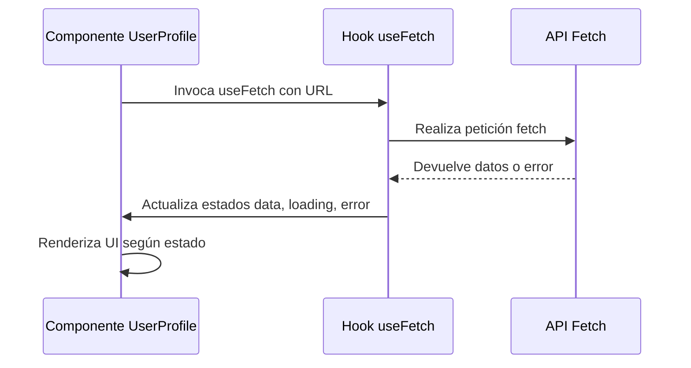

---
readingTime:
  minutes: 1.2
  words: 300
fkglResult: 17.13
---

# 04.2 Implementar un Hook Personalizado

**Objetivo:** Aprender a crear y usar un **hook personalizado** en React Native para obtener y mostrar datos, mejorando la reutilización y claridad del código.

En React Native, los hooks personalizados nos permiten encapsular lógica compleja y reutilizable. Aquí veremos cómo crear un hook llamado `useFetch` para manejar la obtención de datos desde una URL.

```javascript
import { useState, useEffect } from 'react';

const useFetch = (url) => {
  const [data, setData] = useState(null);
  const [loading, setLoading] = useState(true);
  const [error, setError] = useState(null);

  useEffect(() => {
    const fetchData = async () => {
      try {
        const response = await fetch(url);
        const result = await response.json();
        setData(result);
      } catch (err) {
        setError(err);
      } finally {
        setLoading(false);
      }
    };
    fetchData();
  }, [url]);

  return { data, loading, error };
};

export default useFetch;
```

Luego, en un componente, podemos usar este hook para mostrar datos:

```javascript
import useFetch from './useFetch';
import { Text } from 'react-native';

const UserProfile = ({ userId }) => {
  const { data, loading, error } = useFetch(`https://api.example.com/users/${userId}`);

  if (loading) return <Text>Cargando...</Text>;
  if (error) return <Text>Error: {error.message}</Text>;

  return <Text>{data.name}</Text>;
};
```

Para entender mejor cómo fluye la información, observa este diagrama que muestra el ciclo de vida del hook y su interacción con el componente:



Este patrón mejora la legibilidad y reutilización del código, separando la lógica de obtención de datos de la presentación.

**¡Ahora es tu turno!** Piensa en cómo podrías adaptar este hook para manejar diferentes tipos de datos o agregar funcionalidades como reintentos o cancelación de peticiones.