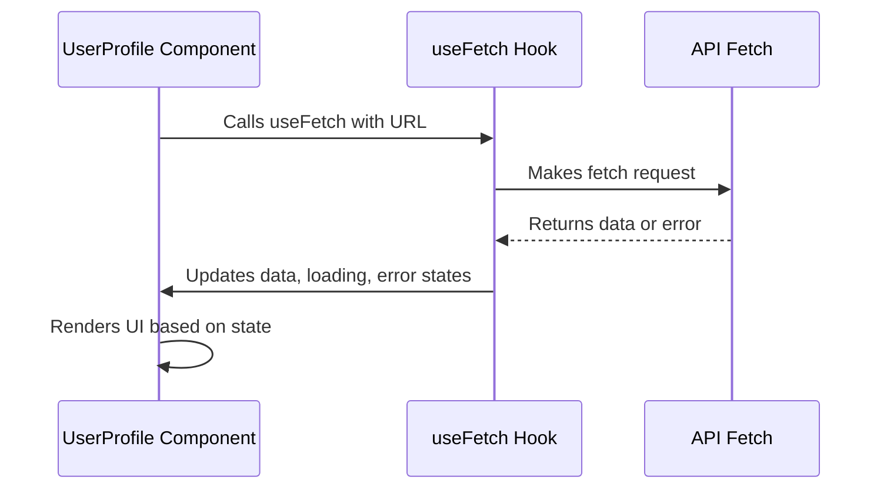

---
readingTime:
  minutes: 1.2
  words: 300
fkglResult: 17.13
---

# 04.2 Implementing a Custom Hook

**Objective:** Learn how to create and use a **custom hook** in React Native to fetch and display data, improving code reuse and clarity.

In React Native, custom hooks allow us to encapsulate complex and reusable logic. Here we will see how to create a hook called `useFetch` to handle data fetching from a URL.

```javascript
import { useState, useEffect } from 'react';

const useFetch = (url) => {
  const [data, setData] = useState(null);
  const [loading, setLoading] = useState(true);
  const [error, setError] = useState(null);

  useEffect(() => {
    const fetchData = async () => {
      try {
        const response = await fetch(url);
        const result = await response.json();
        setData(result);
      } catch (err) {
        setError(err);
      } finally {
        setLoading(false);
      }
    };
    fetchData();
  }, [url]);

  return { data, loading, error };
};

export default useFetch;
```

Then, in a component, we can use this hook to display data:

```javascript
import useFetch from './useFetch';
import { Text } from 'react-native';

const UserProfile = ({ userId }) => {
  const { data, loading, error } = useFetch(`https://api.example.com/users/${userId}`);

  if (loading) return <Text>Loading...</Text>;
  if (error) return <Text>Error: {error.message}</Text>;

  return <Text>{data.name}</Text>;
};
```

To better understand how the information flows, observe this diagram showing the hook's lifecycle and its interaction with the component:



This pattern improves code readability and reuse by separating data fetching logic from presentation.

**Now it's your turn!** Think about how you could adapt this hook to handle different types of data or add features like retries or request cancellation.